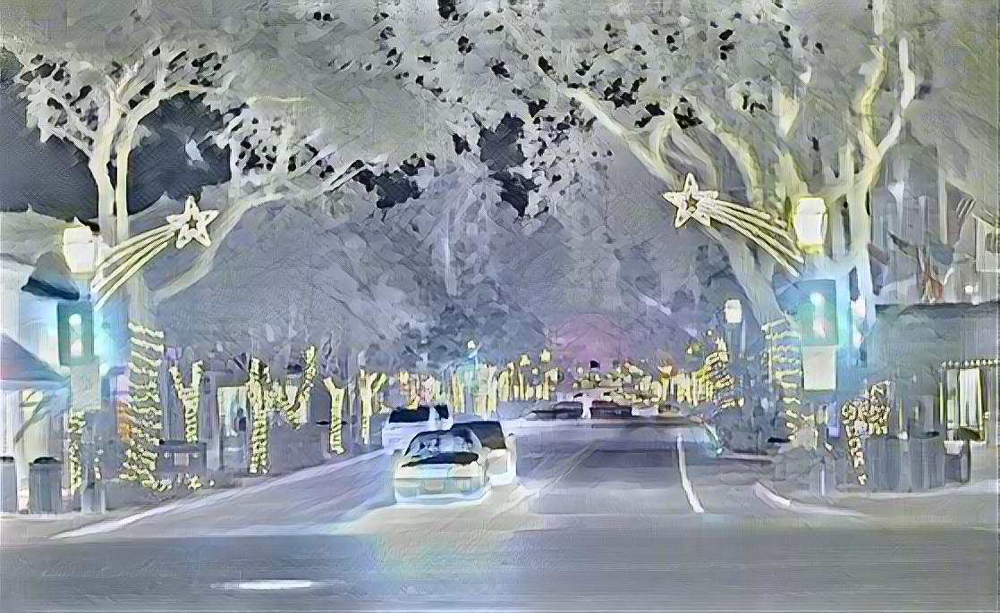
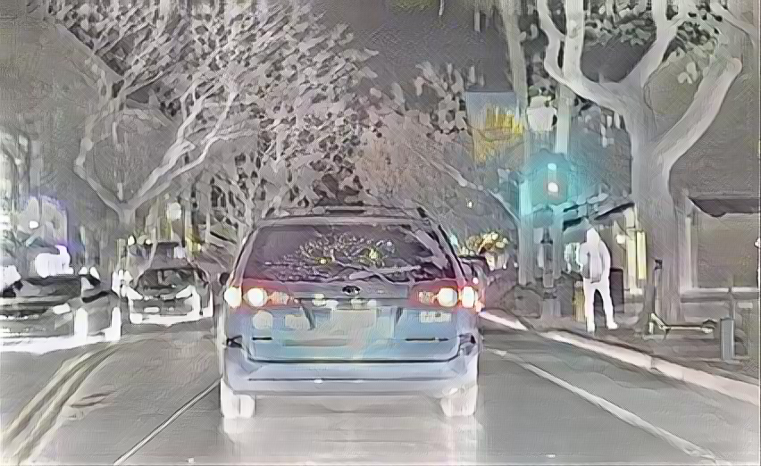

# AutoFuse：Degradation-Resistant Infrared-Visible Image Fusion with Auto-Generated Textual Objectives and Embedded Contrastive Learning

# 1. Create Environment
* create conda environment
```
conda create -n AutoFuse python=3.10
conda activate AutoFuse
```

* Install Dependencies 
```
pip install -r requirements.txt
```
(recommended cuda11.6 and torch 1.13)

# 2. Inference
- Please put test data into the ```test_imgs``` directory 

(infrared images in ```ir``` subfolder, visible images in ```vi``` subfolder)

- Run ```python src/test_sr.py```

The fused results will be saved in the ```./results/``` folder


# 3. Training
## 3.1 Large Models Preparation

For training, please **download the weights of the required large models**.

### Qwen-VL

- Download the model weights from [Hugging Face - Qwen](https://huggingface.co/Qwen/Qwen2-VL-2B-Instruct/tree/main).
- Place the downloaded weights in the ```./Qwen/``` directory.
- Recommended version: Qwen2 (or newer, >2B parameters).

### Llama

- Download the model weights from [Hugging Face - Llama](https://huggingface.co/meta-llama/Llama-3.2-3B-Instruct/tree/main).
- Place the downloaded weights in the ```./meta-llama/``` directory.
- Recommended version: Llama 3.2 (or newer, >3B parameters).

---

## 3.2 Pre-Cache Training Samples
### 1. Generate Training Samples
To reduce computational overhead during training, you can **pre-cache sufficient image patches and related prompts** by running:

```
python ./gen_prompt/gen_data_vi_ir.py --device cuda:0 --repeat 30 20 60 --output_dir training_samples
```

This will generate infrared image patches in ```./training_samples/ir```, visible image patches in ```./training_samples/vi```, and text in ```./training_samples/text```.

### 2. Check Training Samples

Next, run ```python ./gen_prompt/check_json.py``` to automatically check and update the generated json files.

The updated files are saved by default in ```./training_samples/prompt```.

Files in ```./training_samples/ir```, ```./training_samples/vi```, ```./training_samples/prompt``` will be used for model training.

### 3. Our Training Samples
In our experiments, we generated approximately 300K images-text pairs for model training. 

We also upload these training samples so that you can directly download and use them. 

```
Baidu Cloud Disk link: https://pan.baidu.com/s/1tfG0twkpnUkeWhDHuWwivw?pwd=auto 

Extraction code: auto 
```

## 3.3 Model Training

For multi-GPU training, run the following command to train the fusion model:
```
CUDA_VISIBLE_DEVICES=0,1,2,3 OMP_NUM_THREADS=32 python -m torch.distributed.launch --nproc_per_node=4 --node_rank=0 src_fusion/trainer.py
```

For single-GPU training, run:
```
python src_fusion/trainer.py
```

The default path for the dataset is "./training_samples". If it is located elsewhere, please modify the ```data_dir``` in ```IVTData.py``` and specify your path accordingly.

Once the training is complete, the large models and prompts will no longer be required. 

If you have any questions, feel free to contact us via email at wayhao@bit.edu.cn.


# Examples
From left to right are the infrared image, visible image, and fused image.

<div style="display: flex; gap: 10px;">
  
  
  
</div>

---

<div style="display: flex; gap: 10px;">
  
  
  
</div>

