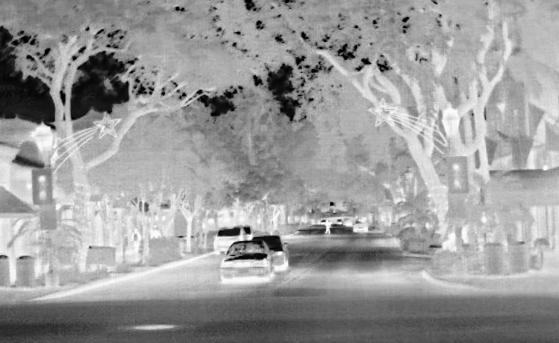
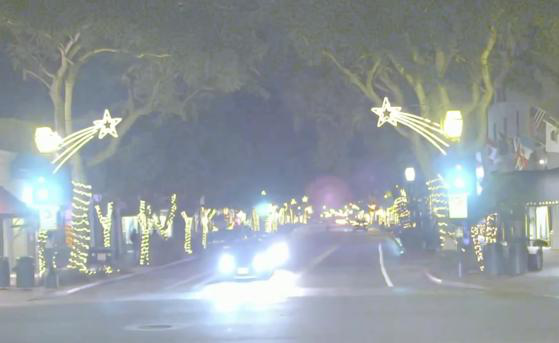
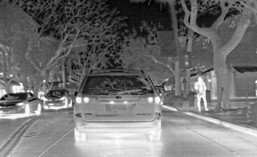
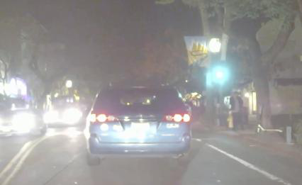

# AutoFuse：Degradation-Resistant Infrared-Visible Image Fusion with Auto-Generated Textual Objectives and Embedded Contrastive Learning

# Usage
## 1. Create Environment
* create conda environment
```
conda create -n AutoFuse python=3.9.12
conda activate AutoFuse
```

* Install Dependencies 
```
pip install -r requirements.txt
```
(recommended cuda11.1 and torch 1.8.2)

## 2. Data Preparation and Running
Please put test data into the ```test_imgs``` directory 

(infrared images in ```ir``` subfolder, visible images in ```vi``` subfolder)

Run ```python src/test_sr.py```

The fused results will be saved in the ```./results/``` folder

# Examples
From left to right are the infrared image, visible image, and fused image.

<div style="display: flex; gap: 10px;">
  
  
  
</div>

---

<div style="display: flex; gap: 10px;">
  
  
  
</div>

