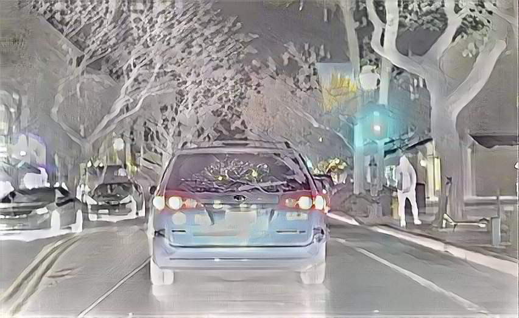

# AutoFuse：Degradation-Resistant Infrared-Visible Image Fusion with Auto-Generated Textual Objectives and Embedded Contrastive Learning

# 1. Create Environment
* create conda environment
```
conda create -n AutoFuse python=3.10
conda activate AutoFuse
```

* Install Dependencies 
```
pip install -r requirements.txt
```
(recommended cuda11.6 and torch 1.13)

# 2. Inference
- Please put test data into the ```test_imgs``` directory 

(infrared images in ```ir``` subfolder, visible images in ```vi``` subfolder)

- Run ```python src/test_sr.py```

The fused results will be saved in the ```./results/``` folder


# 3. Training
## 3.1 Large Models Preparation

For training, you need to **download the weights of the required large models**.

### Qwen-VL

- Download the model weights from [Hugging Face - Qwen](https://huggingface.co/Qwen/Qwen2-VL-2B-Instruct/tree/main).
- Place the downloaded weights in the ```./Qwen/``` directory.
- Recommended version: Qwen2 (or newer, >2B parameters).

### Llama

- Download the model weights from [Hugging Face - Llama](https://huggingface.co/meta-llama/Llama-3.2-3B-Instruct/tree/main).
- Place the downloaded weights in the ```./meta-llama/``` directory.
- Recommended version: Llama 3.2 (or newer, >3B parameters).

---

## 3.2 Data Preparation and Training

To reduce computational overhead during training, you can **pre-cache sufficient image patches and related prompts** by running:

```
python ./gen_prompt/gen_data_vi_ir.py
```

After that, run the following command to train the fusion model:
```
CUDA_VISIBLE_DEVICES=0,1,2,3 OMP_NUM_THREADS=32 python -m torch.distributed.launch --nproc_per_node=4 --node_rank=0 src_fusion/trainer.py
```
Once the training is complete, the large models and prompts will no longer be required.


# Examples
From left to right are the infrared image, visible image, and fused image.

<div style="display: flex; gap: 10px;">
  
  
  
</div>

---

<div style="display: flex; gap: 10px;">
  
  
  
</div>

